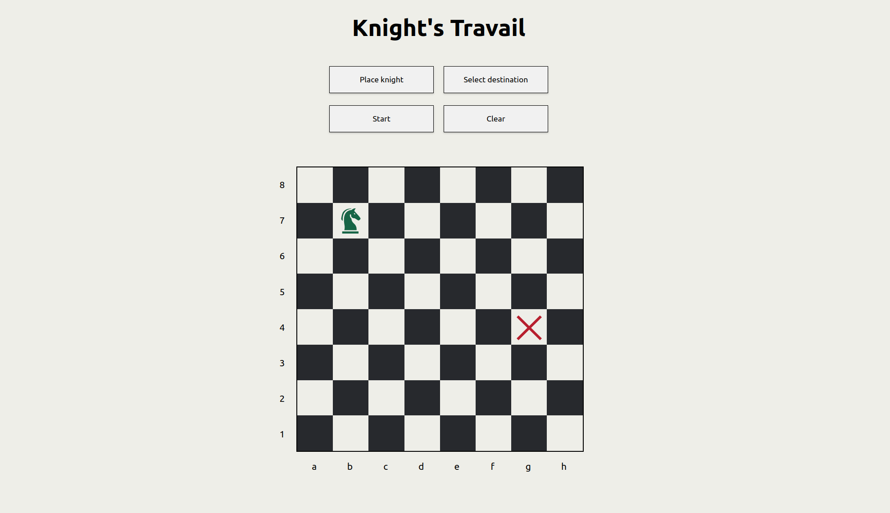

# Knight's Travail

A web application that you to interact with a chessboard, placing a knight and a destination to discover the shortest path the knight can take to reach it's goal.

## Features

- **Interactive chessboard:** Easily place your knight/destination by clicking the button for them and selecting the tile where you want to place them.
- **Shortest Path Visualization:** See the path the knight takes in real time, as it is highlighted before moving the knight square by square to it's destination.
- **Algorithm:** Utilizes breadth-first search(BFS) to efficiently find the shortest path.
- **Audio:** Provides sounds for added immersion. When you place the knight or the destination, as well as when the knight moves, a sound is played.
- **Responsive design:** The website is both desktop and mobile-friendly.

## Usage

1. Visit the [website](https://noname-256.github.io/knights-travail/) hosted on github pages.
2. Place the knight and the destination on the board.
3. Click the start button.
4. See the shortest path from the knight to the destination in real time.
5. Use the clear button to reset the board.

## Technologies used

- HTML
- CSS
- Vanilla JS
